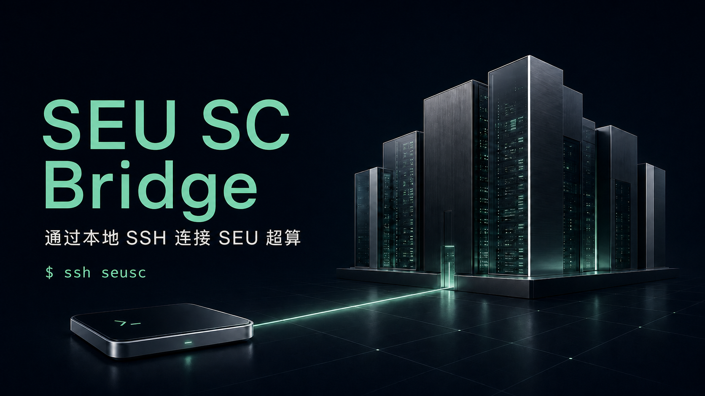

  

  <strong>通过本地 SSH 连接 SEU 超算。</strong> 
  登录一次，用 <code>ssh seusc</code> 连接 SEU 超算。

  
  
  
  

  <a href="https://github.com/PureStudyer/SEU-SC-Bridge/releases/tag/v1.0.0">下载安装</a> ·
  <a href="#三步开始">快速开始</a> ·
  <a href="docs/guide.md">使用手册</a> ·
  <a href="https://github.com/PureStudyer/SEU-SC-Bridge/issues">反馈问题</a>

---

SEU SC Bridge 是一个非官方的 SEU 超算桌面客户端，将平台 WebShell 桥接为本地 SSH 入口。它自动完成浏览器登录和会话恢复，让你继续使用熟悉的 PowerShell、Windows Terminal 或 macOS Terminal。

**无需 WSL，无需 Python，无需手动复制 Token。**

## 三步开始

### 1. 下载并安装

从 **[GitHub Releases](https://github.com/PureStudyer/SEU-SC-Bridge/releases/tag/v1.0.0)** 下载：

| 系统 | 文件 | 验证状态 |
| --- | --- | --- |
| Windows 10/11 · Intel / AMD | [SEU-SC-Bridge-Setup-x64.exe](https://github.com/PureStudyer/SEU-SC-Bridge/releases/download/v1.0.0/SEU-SC-Bridge-Setup-x64.exe) | 已完成真实账号端到端测试 |
| Windows 11 · ARM64 | [SEU-SC-Bridge-Setup-arm64.exe](https://github.com/PureStudyer/SEU-SC-Bridge/releases/download/v1.0.0/SEU-SC-Bridge-Setup-arm64.exe) | 已交叉构建，待 ARM64 实机验证 |
| macOS · Intel / Apple Silicon | 原生构建脚本与 CI 提供 app / DMG 构建 | 待实机验证；构建产物见 Actions |

> **v1.0.0 为公开预览版。** Windows 安装包尚未代码签名；macOS 尚未完成 Developer ID 签名、公证和实机验收。请从此仓库的 Release 下载，并对照 SHA256SUMS.txt 校验文件。

Windows 使用当前用户安装，无需管理员权限。需要 **Chrome / Edge / Chromium**；桌面界面需要 **Microsoft Edge WebView2 Runtime**。

### 2. 登录账号

打开 **SEU SC Bridge**，输入超算平台账号与密码，点击 **登录并启动**。遇到验证码或统一认证时，在自动打开的浏览器中完成验证。

“记住密码”默认关闭。开启时密码保存到 Windows Credential Manager / macOS Keychain；登录会话使用 SEUSC 独立的浏览器配置。

### 3. 打开终端

~~~sh
ssh seusc
~~~

也可以直接运行命令：

~~~sh
ssh seusc hostname
ssh seusc pwd
ssh seusc squeue
~~~

安装与启动过程会创建专用 SSH 密钥及 Host 别名。**正常使用不需要 -F，也不需要手动编辑 SSH config。** 关闭主窗口后，代理保持运行；托盘菜单可重新打开窗口或退出。

## 文件上传与下载

直接使用系统自带的 scp / sftp，复用同一个登录会话：

~~~powershell
# 上传到远端家目录
scp .\result.bin seusc:~/result.bin

# 下载到当前目录
scp seusc:~/result.bin .\result.bin

# 交互式或脚本化 SFTP
sftp seusc
sftp -b commands.txt seusc
~~~

SFTP 中可以使用 put、get、ls、mkdir、rename、rm、rmdir。支持二进制、大文件分块、空文件、中文/空格文件名及覆盖上传；无需在 GUI 中选文件。

现代 OpenSSH 的 scp 默认使用 SFTP；Windows 9.5p2 已实测。**不支持 scp -O 的旧 SCP 协议**。当前不支持追加、权限/时间戳保留（例如 scp -p）、链接创建或完整 POSIX 文件系统语义。

文件通过 SEU 网页 Finder 接口传输。为兼容 SFTP 随机读写，当前版本在本机私有目录暂存文件；上传在远端分块合并后改名，下载完整性按大小检查。请预留与传输文件相当的本地可用空间。大文件最终合并时进度可能短暂停留在 100%。

## 为日常终端工作准备

| 能力 | 实现 |
| --- | --- |
| 自动登录 | Chromium/CDP 执行网站登录，自动获取 Bearer |
| 持久会话 | 重启恢复浏览器会话，鉴权失败后刷新并重试一次 |
| 交互终端 | ANSI 输出、UTF-8 中文、控制键、PTY 窗口缩放 |
| 多会话 | 每个 SSH 会话使用独立 WebSocket / PTY |
| 直接执行命令 | 隔离横幅与回显，返回远端退出码 |
| 文件传输 | 标准 SFTP / 现代 scp，复用自动登录与网页文件接口 |
| 原生后台 | 单实例代理、托盘 / 菜单栏、用户级自启动 |
| 可诊断 | 状态、轮转日志、doctor、可配置登录节点 |

## 工作方式

~~~text
你的终端                  本机后台代理                 SEU 超算
ssh seusc ──SSH 公钥──▶ 127.0.0.1:24822 ──WSS──▶ WebShell / PTY
scp / sftp ──SFTP──▶ 同一 SSH 入口 ──HTTPS──▶ Finder 文件接口
                             ▲
                        独立浏览器登录
~~~

SSH 只监听回环地址，只接受 SEUSC 生成的客户端公钥。TLS 校验保持开启，主机密钥通过专用 known_hosts 固定。日志和应用配置不保存密码、Bearer 或 Cookie；浏览器 profile 自身会持久化站点登录数据。

## 常用命令

~~~sh
seusc status          # 连接状态
seusc login           # 登录（终端隐藏密码输入）
seusc doctor          # 检查配置、密钥、网络和 WebShell
seusc restart         # 重启代理
seusc node            # 查看登录节点
seusc node login02 7  # 添加并切换节点
seusc logs            # 查看最近日志
seusc logout          # 清除保存的密码与浏览器登录会话
~~~

若 seusc 尚未加入 PATH，PowerShell 使用：

~~~powershell
& "$env:LOCALAPPDATA\Programs\SEUSC\seusc.exe" status
~~~

**ssh seusc** 由 OpenSSH 配置提供，不依赖 SEU SC Bridge 是否在 PATH 中。

## 支持范围

WebShell 的上游是 PTY，因此它不是完整的远端 SSH 守护进程：

- 暂不支持 **旧 SCP 协议（scp -O）、VS Code Remote SSH、端口转发、SSH agent / X11 转发**。
- exec 模式不支持 stdin 管道；stdout/stderr 合流，可能带 CRLF；命令长度约限 3 KB。
- 当前 SEU 网站使用 JSON 输入帧；默认适配该协议，并保留 spec 中的 binary 模式。JSON 模式支持 UTF-8 和终端控制字符，不支持任意非 UTF-8 输入。
- 上游断线会结束当前 SSH 会话，不会静默重建丢失的 PTY。
- Windows x64 已验证登录、命令、中文、退出码、PTY 缩放、Ctrl+C、代理重启恢复及原生 scp/SFTP 文件往返；完整终端应用矩阵、机器重启与其他架构仍需验收。

详见 [协议与安全说明](docs/guide.md)、[验收记录](docs/implementation.md)。

## 开发与构建

Go **1.26+**；前端嵌入到程序，不依赖 Node/npm 构建。

~~~sh
go test ./... -timeout 120s
go vet ./...
go build -o seusc ./cmd/seusc
~~~

桌面版本必须使用 desktop,production build tags。Windows：

~~~powershell
./scripts/build.ps1 -Arch amd64
./scripts/build.ps1 -Arch arm64
makensis /DARCH=amd64 packaging/windows/installer.nsi
~~~

macOS（Xcode Command Line Tools）：

~~~sh
bash scripts/build-macos.sh arm64
bash scripts/build-macos.sh amd64
~~~

[CI](.github/workflows/ci.yml) 包含离线测试、race 检查及四架构构建。真实账号测试默认禁用，运行方式见 [测试说明](docs/testing.md)。

## 文档与贡献

- [使用与配置手册](docs/guide.md)
- [配置示例](docs/config.example.json)
- [测试和验收](docs/testing.md)
- [开发与贡献](CONTRIBUTING.md)
- [安全问题反馈](SECURITY.md)
- [更新记录](CHANGELOG.md)
- [原始规格（示例账号已匿名化）](docs/SEUSC_SPEC.md)

这是独立开源项目，未经东南大学官方背书。请仅使用自己有权访问的账号与计算资源。

## License

[MIT](LICENSE) · Copyright © 2026 PureStudyer
